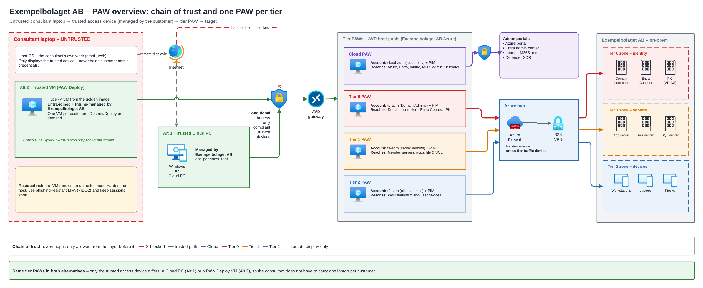

# PAW-Deploy Documentation

This folder holds the detailed documentation for PAW-Deploy. The [root README](../README.md) is a short project summary — start here for anything more in-depth.

## Setup

Everything needed to prepare, configure, and install PAW-Deploy.

| Doc | Purpose |
| --- | --- |
| [setup/README.md](setup/README.md) | Setup guide index and recommended order of operations. |
| [setup/REQUIREMENTS.md](setup/REQUIREMENTS.md) | Host, network, and account prerequisites. |
| [setup/PREPARATION.md](setup/PREPARATION.md) | What to prepare before running the installer (template VHDX, config, packaging). |
| [setup/CONFIGURATION.md](setup/CONFIGURATION.md) | `Settings.psm1`, `Apps.xml`, `Modules.xml`, packages and `Config.xml` reference. |
| [setup/INSTALLATION.md](setup/INSTALLATION.md) | Manual, Intune, and SCCM installation, stages, registry layout, logging, and uninstall. |
| [setup/VMDeploy-Detections.txt](setup/VMDeploy-Detections.txt) | Reference export of the registry values used for Intune detection rules. |

## Templates

| File | Purpose |
| --- | --- |
| [templates/Package-Template.xml](templates/Package-Template.xml) | Commented starting point for a new VM Deploy package (apps, modules and downloads). Copy it to `Source\VMDeploy\Packages\<Name>.xml`. |

## Release notes

See [CHANGELOG.md](../CHANGELOG.md) for what changed in each version.

## Security

| Doc | Purpose |
| --- | --- |
| [security/README.md](security/README.md) | The PAW access model in short, with diagrams: chain of trust, Cloud PC vs PAW-Deploy, reach per tier and access flow. |
| [security/PAW-CONCEPT.md](security/PAW-CONCEPT.md) | The Privileged Access Workstation model, where PAW-Deploy fits in it, and why it matters. |
| [security/SECURITY-REVIEW.md](security/SECURITY-REVIEW.md) | Findings from a source-code security review of the installer and VMDeploy tooling. |

### PAW access model

**What matters is how a device is managed, not what kind of device it is.** Privileged access always starts from a trusted access device that the customer manages. PAW-Deploy is one way to deliver that device: a Hyper-V VM on the consultant's laptop, enrolled in the customer's Entra ID and Intune. See [security/README.md](security/README.md) for the full model and all diagrams.

