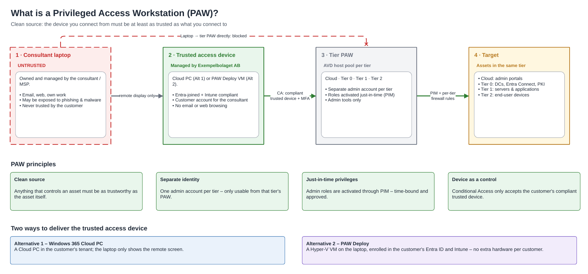
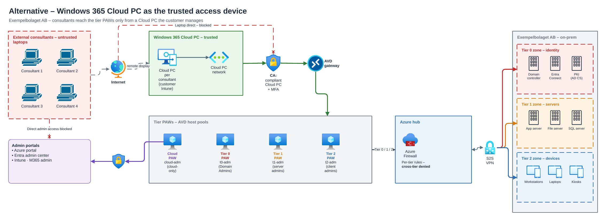
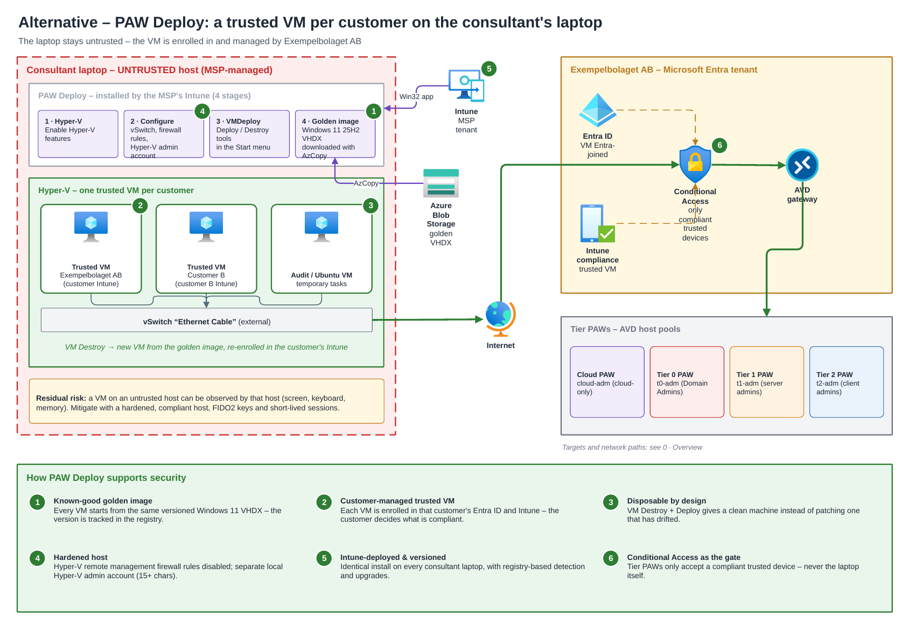
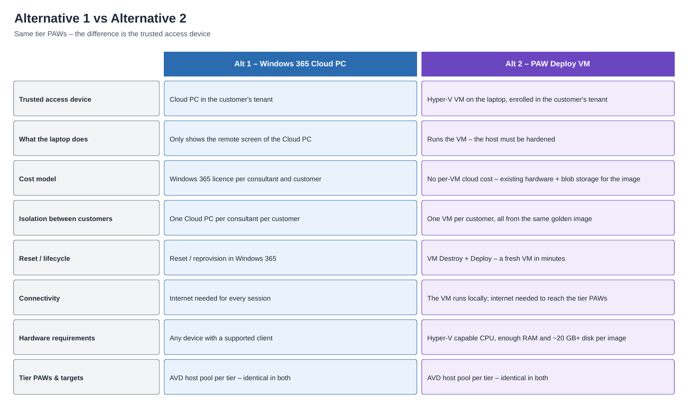
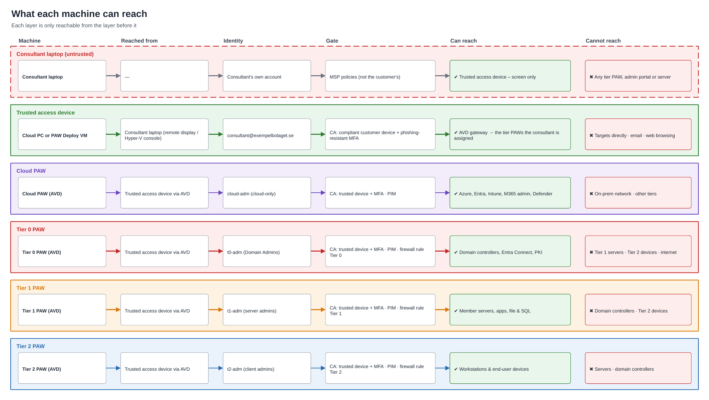
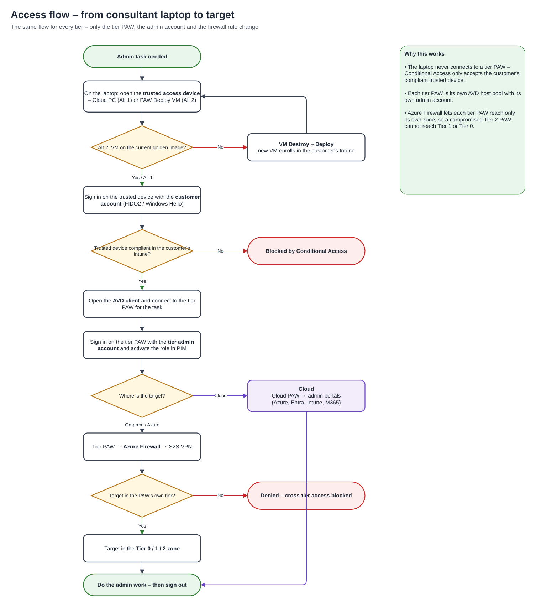

# PAW-Deploy Security

This folder describes the security model PAW-Deploy is built for, how the tool fits into it, and how well the current code lives up to it.

| Doc | Purpose |
| --- | --- |
| [PAW-CONCEPT.md](PAW-CONCEPT.md) | The Privileged Access Workstation model, where PAW-Deploy fits in it, and why it is worth the operational cost. |
| [SECURITY-REVIEW.md](SECURITY-REVIEW.md) | Findings from a source-code security review of the installer and VMDeploy tooling, with remediation status. |
| [diagrams/PAW-Access-Model.pdf](diagrams/PAW-Access-Model.pdf) | All diagrams below in one PDF. |

## The model in short

**What matters is how a device is managed, not what kind of device it is.** A consultant's own laptop is managed by the consultant or their MSP, so the customer can never trust it. Privileged access therefore always starts from a *trusted access device* that the customer owns and manages (Entra-joined, Intune-compliant). That device is the only thing Conditional Access lets through to the tier PAWs.

```text
Consultant laptop  ──►  Trusted access device  ──►  Tier PAW  ──►  Target
   (untrusted)          (customer-managed)          (per tier)      (same tier)
  remote display         CA: compliant + MFA        PIM + per-tier firewall rules
```

Every hop is only allowed from the layer before it. The laptop can display the trusted device, but it can never reach a tier PAW, an admin portal or a server itself.

The trusted access device can be delivered in several ways, and PAW-Deploy is one of them:

- **Alternative 1 – Windows 365 Cloud PC** in the customer's tenant. The laptop only shows the remote screen.
- **Alternative 2 – PAW-Deploy.** A Hyper-V VM on the consultant's laptop, enrolled in the customer's Entra ID and Intune. One VM per customer, all built from the same golden image.
- **A dedicated physical device** per customer.

Behind the trusted device the model is the same in every alternative. There is one PAW per tier (Cloud, Tier 0, Tier 1, Tier 2), each an AVD host pool with its own admin account. Roles are activated just-in-time through PIM, and Azure Firewall rules deny cross-tier traffic.

> **PAW-Deploy builds the trusted access device, not the tier PAWs.** The tier PAWs, Conditional Access policies, PIM and firewall rules belong to the customer's environment and are outside the scope of this repository.

## Diagrams

The diagrams use a fictional customer, *Exempelbolaget AB*. Account names, zones and servers are examples.

### 0 · Overview

The whole chain on one page: the untrusted laptop, both ways to deliver the trusted access device, the four tier PAWs, and the targets each tier reaches through the Azure hub.


<details>
<summary><b>1 · What is a PAW</b> – the chain of trust and the four PAW principles</summary>

The *clean source* principle: the device you connect from must be at least as trusted as what you connect to. The diagram also lists the four principles the model rests on:

- **Clean source.** Anything that controls an asset must be as trustworthy as the asset itself.
- **Separate identity.** One admin account per tier, usable only from that tier's PAW.
- **Just-in-time privileges.** Admin roles are activated through PIM, time-bound and approved.
- **Device as a control.** Conditional Access only accepts the customer's compliant trusted device.


</details>

<details>
<summary><b>2 · Alternative 1</b> – Windows 365 Cloud PC as the trusted access device</summary>

Each consultant gets a Cloud PC per customer, managed in the customer's Intune. The laptop only carries the remote display, and direct admin access from the laptop is blocked.


</details>

<details>
<summary><b>3 · Alternative 2</b> – PAW-Deploy: a trusted VM per customer on the consultant's laptop</summary>

The MSP's Intune installs PAW-Deploy on the laptop as a Win32 app in four stages: Hyper-V, configuration, the VMDeploy tools and the golden image. The consultant then deploys one VM per customer, and each VM is enrolled in that customer's Entra ID and Intune. The numbered markers show how PAW-Deploy supports the model:

1. **Known-good golden image.** Every VM starts from the same versioned Windows 11 VHDX, and the version is tracked in the registry.
2. **Customer-managed trusted VM.** The customer, not the consultant, decides what counts as compliant.
3. **Disposable by design.** VM Destroy + Deploy gives a clean machine instead of patching one that has drifted.
4. **Hardened host.** Hyper-V remote-management firewall rules are disabled by default, and a separate local Hyper-V admin account can be created (optional).
5. **Intune-deployed and versioned.** Every consultant laptop gets the same install, with registry-based detection and upgrades.
6. **Conditional Access as the gate.** Tier PAWs only accept a compliant trusted device, never the laptop itself.

**Residual risk:** the VM runs on a host the customer does not control, and that host can observe it (screen, keyboard, memory). Mitigate with a hardened, compliant host, FIDO2 keys and short-lived sessions. See [PAW-CONCEPT.md](PAW-CONCEPT.md#the-residual-risk-of-a-vm-on-an-untrusted-host).


</details>

<details>
<summary><b>4 · Comparison</b> – Cloud PC vs PAW-Deploy</summary>

The tier PAWs and targets are identical in both alternatives. What differs is cost (Windows 365 licence vs existing hardware), what the laptop does (display only vs running the VM), connectivity and hardware requirements.


</details>

<details>
<summary><b>5 · Reach per machine</b> – what each layer and tier PAW can and cannot reach</summary>

For each machine: where it is reached from, which identity is used, which gate it passes, and what it can and cannot reach. For example, a Tier 2 PAW reaches workstations and end-user devices but never servers or domain controllers.


</details>

<details>
<summary><b>6 · Access flow</b> – step by step from laptop to target</summary>

The same flow applies to every tier. Only the tier PAW, the admin account and the firewall rule change. For Alternative 2, a VM that is not on the current golden image is destroyed and redeployed before use.


</details>
